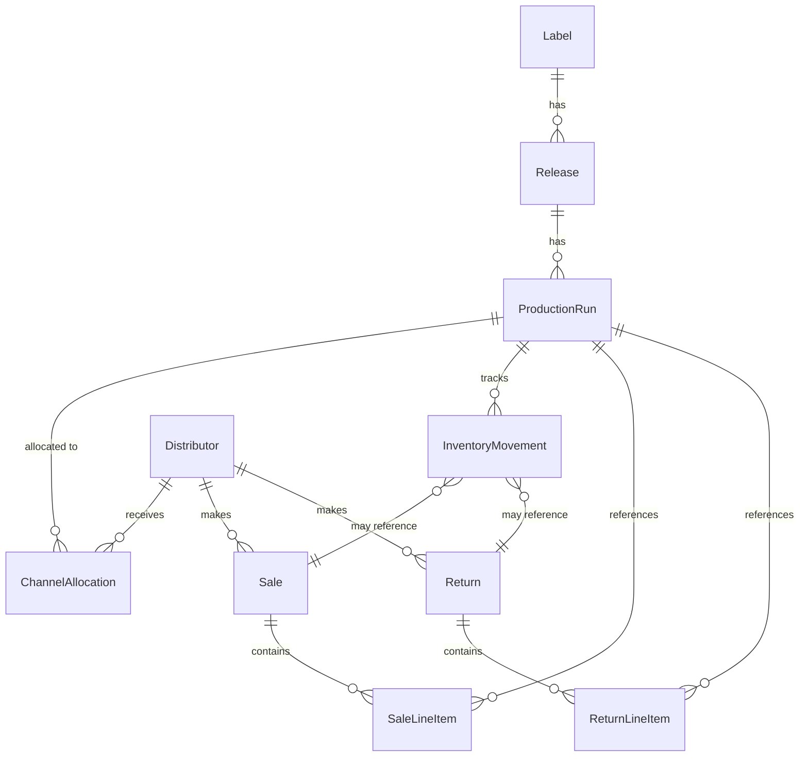

# Requirements: Distributor Sales Recording and Inventory Visibility

## Overview
- **Business Problem**: Need to track distributor sales, process returns, and maintain accurate inventory visibility across locations (warehouse and distributors)
- **Target Users**: Label managers who need to record monthly sales reports from distributors and monitor inventory
- **Business Value**: Accurate inventory tracking enables better decision-making about manufacturing, distribution, and identifies which releases are performing well

## Business Objectives
- **Primary Goal**: Enable recording of distributor sales with automatic inventory updates while maintaining complete visibility of where physical inventory is located
- **Success Criteria**:
  - Can enter monthly distributor sales reports and see inventory automatically decrease
  - Can process returns from distributors back to warehouse
  - Can view current inventory location and status for any release at any time
  - Movement history provides complete audit trail of all inventory changes

## Scope
### In Scope
- Recording sales from distributors to end customers
- Processing returns from distributors back to warehouse
- Automatic inventory updates when sales/returns are recorded
- Inventory visibility showing stock by location (warehouse and each distributor)
- Sales history views (by label, by distributor, by release)
- Editing and deleting sales/returns with inventory adjustments
- Movement history tracking

### Out of Scope
- Direct sales (label → consumer)
- Shop/retail sales
- Online platform sales (Bandcamp, etc.)
- Distributor shipping/billing addresses (future enhancement)
- Role-based access control (all users can perform all operations)
- Multi-currency support (single currency only)
- Financial tracking for returns (restocking fees, refunds)

## User Roles
- **Label Manager**: Records sales and returns from distributor reports, monitors inventory levels, reviews sales history

## Core Entities

### Sale
**Business Description**: A transaction where a distributor sold physical inventory to end customers. Reported monthly by distributors.

**Key Attributes**:
- Distributor (required) - Which distributor made the sales
- Sale date (required) - When the sales occurred (per distributor report)
- Line items (required, 1+) - List of releases sold with quantities and prices
  - Release (required) - Which release was sold
  - Quantity (required) - Number of units sold
  - Unit price (required) - Wholesale price per unit (single currency)
  - Revenue (calculated) - Quantity × Unit price
- Total revenue (calculated) - Sum of all line item revenues

**Relationships**:
- One Sale belongs to one Distributor
- One Sale contains many Line Items
- Each Line Item references one Release (via Production Run)

### Return
**Business Description**: A transaction where a distributor returns unsold physical inventory back to the label's warehouse.

**Key Attributes**:
- Distributor (required) - Which distributor is returning inventory
- Return date (required) - When the return occurred
- Line items (required, 1+) - List of releases being returned
  - Release (required) - Which release is being returned
  - Quantity (required) - Number of units being returned

**Relationships**:
- One Return belongs to one Distributor
- One Return contains many Line Items
- Each Line Item references one Release (via Production Run)

### Inventory Movement
**Business Description**: An audit record of inventory changing location or quantity. Generated automatically for allocations, sales, and returns.

**Key Attributes**:
- Movement type (required) - ALLOCATION, SALE, or RETURN
- Production run (required) - Which production run the inventory came from
- From location (optional) - Where inventory came from (null for allocations, distributor for returns)
- To location (optional) - Where inventory went (distributor for allocations/sales, warehouse for returns)
- Quantity (required) - Number of units moved
- Date (required) - When the movement occurred
- Reference ID (optional) - ID of the sale or return that caused this movement

**Relationships**:
- One Movement references one Production Run
- One Movement may reference one Sale or one Return

### Entity Relationship Diagram

## Business Rules

### Rule: Cannot Sell More Than Allocated
**Description**: A distributor cannot sell more units than they currently have in their inventory.

**When**: User attempts to save a sale record
**Then**: System validates that for each line item, the quantity sold does not exceed the distributor's current inventory for that production run
**Example**:
- Distributor A has 300 units of Release X vinyl allocated
- Distributor A has already sold 100 units (200 remaining)
- User tries to enter a new sale of 250 units
- System blocks the sale and shows error: "Insufficient inventory. Distributor A has 200 units available, but you tried to sell 250."

### Rule: Cannot Return More Than Currently Allocated
**Description**: A distributor cannot return more units than they currently have in their inventory.

**When**: User attempts to save a return record
**Then**: System validates that for each line item, the quantity returned does not exceed the distributor's current inventory for that production run
**Example**:
- Distributor B currently has 150 units of Release Y CD
- User tries to enter a return of 200 units
- System blocks the return and shows error: "Invalid return quantity. Distributor B has 150 units, but you tried to return 200."

### Rule: Sales Automatically Update Inventory
**Description**: When a sale is recorded, the system automatically reduces distributor inventory and records a movement.

**When**: User saves a sale record
**Then**:
- For each line item, reduce the distributor's inventory by the quantity sold
- Create an inventory movement record with type SALE, referencing the sale
**Example**:
- User enters sale: Distributor A sold 100 units of Release X on 2026-01-31
- System reduces Distributor A's inventory of Release X by 100 units
- System creates movement: SALE, 100 units, from Distributor A, reference Sale #123

### Rule: Returns Automatically Update Inventory
**Description**: When a return is recorded, the system automatically increases warehouse inventory, decreases distributor inventory, and records a movement.

**When**: User saves a return record
**Then**:
- For each line item, increase warehouse inventory by the quantity returned
- Decrease distributor inventory by the quantity returned
- Create an inventory movement record with type RETURN, referencing the return
**Example**:
- User enters return: Distributor B returned 50 units of Release Y on 2026-02-15
- System increases warehouse inventory of Release Y by 50 units
- System decreases Distributor B's inventory of Release Y by 50 units
- System creates movement: RETURN, 50 units, from Distributor B to Warehouse, reference Return #456

### Rule: Editing Sales Adjusts Inventory
**Description**: When a sale is edited, the system reverses the original inventory changes and applies the new changes.

**When**: User updates an existing sale record
**Then**:
- Reverse the original sale's inventory reductions
- Apply the new sale's inventory reductions
- Update or create new movement records
**Example**:
- Original sale: Distributor A sold 100 units
- User edits to: Distributor A sold 90 units
- System adds 100 units back to Distributor A's inventory
- System subtracts 90 units from Distributor A's inventory
- Net effect: Distributor A gains 10 units back

### Rule: Deleting Sales Reverses Inventory
**Description**: When a sale is deleted, the system reverses the inventory changes.

**When**: User deletes a sale record
**Then**:
- Add back the sold quantities to distributor inventory
- Delete or mark the associated movement records
**Example**:
- Sale to delete: Distributor A sold 100 units
- User deletes the sale
- System adds 100 units back to Distributor A's inventory

### Rule: Calculate Revenue Per Line Item
**Description**: Revenue for each line item is calculated automatically from quantity and unit price.

**When**: User enters or edits a sale line item
**Then**: System calculates revenue = quantity × unit price
**Example**:
- Line item: 100 units of Release X at $8.50 per unit
- System calculates: Revenue = $850.00

### Rule: Calculate Total Sale Revenue
**Description**: Total revenue for a sale is the sum of all line item revenues.

**When**: User saves a sale
**Then**: System calculates total = sum of all line item revenues
**Example**:
- Line item 1: 100 units @ $8.50 = $850.00
- Line item 2: 50 units @ $12.00 = $600.00
- Total sale revenue: $1,450.00

## User Stories

### US-1: Record Multi-Release Sale from Distributor
**As a** label manager
**I want to** enter a sale with multiple releases sold by a distributor
**So that** the inventory is automatically updated and I have accurate sales records

**Acceptance Criteria**:
- [ ] Can select distributor from dropdown
- [ ] Can enter sale date (any past, present, or future date)
- [ ] Can add multiple line items (release, quantity, unit price)
- [ ] System calculates revenue per line item (quantity × price)
- [ ] System calculates total sale revenue (sum of line items)
- [ ] System validates that each quantity sold does not exceed distributor's current inventory
- [ ] On save, distributor inventory is reduced by quantities sold
- [ ] On save, inventory movements are created for each line item
- [ ] If validation fails, show clear error message and prevent save

**Example Scenario**:
- Distributor: "Big Music Distribution"
- Date: 2026-01-31
- Line items:
  - Release "Album A" vinyl: 100 units @ $8.50 = $850.00
  - Release "EP B" vinyl: 50 units @ $6.00 = $300.00
- Total revenue: $1,150.00
- After save: Big Music's inventory reduced by 100 units of Album A and 50 units of EP B

### US-2: View Inventory Status on Release Page
**As a** label manager
**I want to** see where inventory for a release is located and how much has been sold
**So that** I can make informed decisions about manufacturing and distribution

**Acceptance Criteria**:
- [ ] Release detail page shows total manufactured quantity (sum of all production runs)
- [ ] Shows current warehouse inventory
- [ ] Shows inventory at each distributor with breakdown:
  - Allocated quantity (original allocation)
  - Current quantity (remaining)
  - Sold quantity (allocated - current)
- [ ] Shows total sold across all distributors
- [ ] Shows movement history (allocations, sales, returns) with dates and quantities

**Example Scenario**:
Viewing "Album A" vinyl:
- Total manufactured: 1000 units
- Warehouse: 200 units
- Big Music Distribution: 250 units (allocated 500, sold 250)
- Indie Distributors: 100 units (allocated 150, sold 50)
- Total sold: 300 units
- Movement history:
  - 2025-11-15: ALLOCATION, 500 units to Big Music
  - 2025-11-15: ALLOCATION, 150 units to Indie Distributors
  - 2026-01-31: SALE, 250 units from Big Music (Sale #123)
  - 2026-01-31: SALE, 50 units from Indie Distributors (Sale #124)

### US-3: View Sales History by Label
**As a** label manager
**I want to** see all sales for my label
**So that** I can track overall sales performance and revenue

**Acceptance Criteria**:
- [ ] Label has a sales page showing all sales for that label
- [ ] Each sale shows: date, distributor, total units sold, total revenue
- [ ] Sales are sorted by date (newest first)
- [ ] Can click into a sale to see full line item details
- [ ] Sale detail shows: distributor, date, each line item (release, quantity, unit price, revenue), total revenue

**Example Scenario**:
Label "Awesome Records" sales page shows:
- 2026-01-31 | Big Music Distribution | 150 units | $1,150.00
- 2026-01-28 | Indie Distributors | 75 units | $650.00
- 2025-12-31 | Big Music Distribution | 200 units | $1,800.00

Clicking on first sale shows:
- Distributor: Big Music Distribution
- Date: 2026-01-31
- Line items:
  - Album A vinyl: 100 @ $8.50 = $850.00
  - EP B vinyl: 50 @ $6.00 = $300.00
- Total: $1,150.00

### US-4: View Sales History by Distributor
**As a** label manager
**I want to** see all sales from a specific distributor
**So that** I can track that distributor's performance

**Acceptance Criteria**:
- [ ] Distributor detail page shows all sales from that distributor
- [ ] Each sale shows: date, total units sold, total revenue
- [ ] Can click into sale for full details

**Example Scenario**:
"Big Music Distribution" detail page shows sales:
- 2026-01-31 | 150 units | $1,150.00
- 2025-12-31 | 200 units | $1,800.00

### US-5: View Sales History by Release
**As a** label manager
**I want to** see all sales of a specific release across all distributors
**So that** I can track how well that release is performing

**Acceptance Criteria**:
- [ ] Release detail page shows all sales of that release
- [ ] Each sale shows: date, distributor, quantity sold, revenue
- [ ] Shows total units sold and total revenue for the release

**Example Scenario**:
"Album A" vinyl sales:
- 2026-01-31 | Big Music Distribution | 100 units | $850.00
- 2026-01-28 | Indie Distributors | 25 units | $212.50
- 2025-12-31 | Big Music Distribution | 150 units | $1,275.00
- Total: 275 units, $2,337.50

### US-6: Edit a Sale
**As a** label manager
**I want to** correct errors in a sale I entered
**So that** my records are accurate

**Acceptance Criteria**:
- [ ] Can navigate to sale detail and click "Edit"
- [ ] Can modify distributor, date, line items (add, remove, change quantities/prices)
- [ ] System validates new quantities against available inventory (original sale quantities are added back first)
- [ ] On save, inventory is adjusted to reflect the changes
- [ ] Movement records are updated

**Example Scenario**:
- Original sale: Big Music sold 100 units of Album A
- Correction needed: Actually sold 90 units
- User edits sale, changes quantity to 90
- System validation: 100 units added back, then 90 subtracted = 10 units increase to distributor inventory
- After save: Distributor has 10 more units than before

### US-7: Delete a Sale
**As a** label manager
**I want to** delete a sale that was entered in error
**So that** my records are accurate

**Acceptance Criteria**:
- [ ] Can delete a sale from sale detail page
- [ ] System shows confirmation prompt
- [ ] On confirm, inventory is reversed (quantities added back to distributor)
- [ ] Movement records are deleted or marked as reversed
- [ ] Sale no longer appears in any sales history views

**Example Scenario**:
- User deletes sale: Big Music sold 100 units of Album A
- System adds 100 units back to Big Music's inventory
- Sale disappears from all views

### US-8: Record a Return from Distributor
**As a** label manager
**I want to** record when a distributor returns unsold inventory
**So that** my warehouse inventory is accurate

**Acceptance Criteria**:
- [ ] Can select distributor and return date
- [ ] Can add multiple line items (release, quantity)
- [ ] System validates that return quantity does not exceed distributor's current inventory
- [ ] On save, warehouse inventory increases by returned quantities
- [ ] On save, distributor inventory decreases by returned quantities
- [ ] On save, inventory movements are created with type RETURN
- [ ] If validation fails, show clear error message

**Example Scenario**:
- Distributor: Indie Distributors
- Date: 2026-02-15
- Line items:
  - Album A vinyl: 50 units
  - EP B vinyl: 25 units
- After save:
  - Warehouse gains 50 units of Album A, 25 units of EP B
  - Indie Distributors loses 50 units of Album A, 25 units of EP B

### US-9: View Returns by Distributor
**As a** label manager
**I want to** see all returns from a specific distributor
**So that** I can track return patterns

**Acceptance Criteria**:
- [ ] Distributor detail page shows all returns from that distributor
- [ ] Each return shows: date, total units returned
- [ ] Can click into return to see line item details

**Example Scenario**:
"Indie Distributors" detail page shows:
- Returns:
  - 2026-02-15 | 75 units returned
  - 2026-01-10 | 30 units returned

### US-10: Edit a Return
**As a** label manager
**I want to** correct errors in a return I entered
**So that** my records are accurate

**Acceptance Criteria**:
- [ ] Can edit return from return detail page
- [ ] Can modify date, line items
- [ ] System validates new quantities against distributor's current inventory (original return quantities are subtracted first)
- [ ] On save, inventory is adjusted to reflect changes
- [ ] Movement records are updated

### US-11: Delete a Return
**As a** label manager
**I want to** delete a return that was entered in error
**So that** my records are accurate

**Acceptance Criteria**:
- [ ] Can delete a return from return detail page
- [ ] System shows confirmation prompt
- [ ] On confirm, inventory is reversed (warehouse loses returned quantities, distributor gains them back)
- [ ] Movement records are deleted or marked as reversed
- [ ] Return no longer appears in return history

## Workflows

### Workflow: Record a Sale from Monthly Distributor Report
**Trigger**: Label manager receives monthly sales report from distributor

**Steps**:
1. User navigates to "New Sale" page
2. User selects distributor from dropdown
3. User enters sale date (from distributor report)
4. User adds first line item:
   - Selects release and format from dropdown
   - Enters quantity sold
   - Enters unit price
   - System calculates and displays line item revenue
5. User adds additional line items as needed (repeat step 4)
6. System displays total sale revenue
7. User clicks "Save Sale"
8. System validates:
   - All required fields are filled
   - For each line item, quantity sold ≤ distributor's current inventory for that production run
9. **If validation passes**:
   - System creates sale record
   - For each line item:
     - Reduces distributor's inventory by quantity sold
     - Creates inventory movement record (type: SALE, reference: sale ID)
   - Shows success message
   - Redirects to sale detail page
10. **If validation fails**:
    - Shows error message indicating which line items have insufficient inventory
    - User can correct quantities or cancel

**Alternative Paths**:
- User cancels: No changes are saved, returns to previous page
- User adds then removes line items: Only final line items are processed on save

### Workflow: Record a Return
**Trigger**: Distributor sends back unsold inventory

**Steps**:
1. User navigates to "New Return" page
2. User selects distributor
3. User enters return date
4. User adds line items (release, quantity)
5. User clicks "Save Return"
6. System validates:
   - For each line item, return quantity ≤ distributor's current inventory
7. **If validation passes**:
   - Creates return record
   - Increases warehouse inventory
   - Decreases distributor inventory
   - Creates movement records (type: RETURN)
   - Shows success message
8. **If validation fails**:
   - Shows error message
   - User can correct quantities or cancel

### Workflow: View Inventory Status for a Release
**Trigger**: User wants to check current inventory location for a release

**Steps**:
1. User navigates to release detail page
2. System displays:
   - Total manufactured (sum of all production runs)
   - Warehouse current inventory
   - For each distributor with allocations:
     - Distributor name
     - Allocated quantity (original allocation)
     - Current quantity (remaining)
     - Sold quantity (allocated - current)
   - Total sold (sum across all distributors)
3. System displays movement history:
   - Date, movement type (ALLOCATION, SALE, RETURN)
   - From/to locations
   - Quantity
   - Reference (sale/return ID if applicable)
4. Movements sorted by date (newest first)

## Integration Requirements

### Existing Production Run Module
**Business Purpose**: Sales and returns reference production runs to track which manufactured batch the inventory came from

**Data Needed**:
- From Production Run module → Sales/Returns: Production run ID, release ID, format, available quantity
- No data flows back (read-only dependency)

**Frequency**: On demand (when user selects a release to sell/return)

**Business Impact of Failure**: Cannot create sales or returns without knowing which production runs exist

### Existing Allocation Module
**Business Purpose**: Need to know how much inventory each distributor has been allocated

**Data Needed**:
- From Allocation module → Sales/Returns: Current allocated quantity per distributor per production run
- From Sales/Returns → Allocation module: Update allocated quantities when sales/returns occur

**Frequency**: Real-time (during sale/return creation and validation)

**Business Impact of Failure**: Cannot validate sales/returns, inventory will be inaccurate

### Existing Distributor Module
**Business Purpose**: Sales and returns are associated with distributors

**Data Needed**:
- From Distributor module → Sales/Returns: Distributor ID, name
- No data flows back (read-only dependency)

**Frequency**: On demand (when user selects a distributor)

**Business Impact of Failure**: Cannot create sales or returns without distributor information

## User Interface Requirements

**Key Interactions**:
- Create new sale: Select distributor, enter date, add/remove line items, see running total, save
- Create new return: Select distributor, enter date, add/remove line items, save
- View inventory status: See inventory breakdown by location on release detail page
- View sales history: See lists of sales on label/distributor/release pages, click to see details
- Edit sale/return: Modify existing record with same interface as creation
- Delete sale/return: Confirm and remove record

**Required Information Display**:
- Sale list view: Date, distributor, total units, total revenue
- Sale detail view: Distributor, date, line items (release, quantity, unit price, revenue), total revenue
- Return list view: Date, distributor, total units returned
- Return detail view: Distributor, date, line items (release, quantity)
- Inventory breakdown: Total manufactured, warehouse stock, distributor stocks (allocated/current/sold)
- Movement history: Date, type, from/to, quantity, reference

**User Flows**:
1. **Record Sale**: Navigate to sales → New sale → Select distributor → Enter date → Add line items → Save → View confirmation
2. **View Inventory**: Navigate to release → View inventory section → See breakdown and movements
3. **View Sales**: Navigate to label/distributor/release → View sales list → Click sale → View details
4. **Process Return**: Navigate to returns → New return → Select distributor → Enter date → Add line items → Save → View confirmation

## Reporting & Analytics

### Report: Sales by Label
**Business Question**: What are all the sales for this label?
**Data Needed**: All sales for the label, with date, distributor, total units, total revenue
**Audience**: Label manager, reviewed regularly (weekly/monthly)
**Success Metric**: Manager can quickly see recent sales and overall revenue trends

### Report: Sales by Distributor
**Business Question**: How is this distributor performing?
**Data Needed**: All sales from a specific distributor, with dates, units, revenue
**Audience**: Label manager, reviewed when evaluating distributor relationships
**Success Metric**: Manager can assess distributor performance and identify trends

### Report: Sales by Release
**Business Question**: How well is this release selling?
**Data Needed**: All sales of a specific release across all distributors
**Audience**: Label manager, A&R team, reviewed to assess release performance
**Success Metric**: Can quickly see which releases are selling well and which are underperforming

### Report: Inventory Status
**Business Question**: Where is my inventory and how much has been sold?
**Data Needed**: Current inventory by location, allocated vs sold amounts, movement history
**Audience**: Label manager, reviewed frequently (daily/weekly)
**Success Metric**: Manager always knows current inventory status and can make informed manufacturing decisions

## Access Control & Security

**Who Can Do What**:
- All users: Can create, edit, delete sales and returns; can view all inventory and sales data

**Data Sensitivity**:
- Wholesale prices are business-sensitive and should not be exposed publicly
- Sales data reveals business performance and should be kept confidential
- Distributor relationships and performance data is confidential

**Audit Requirements**:
- All sales and returns should be recorded with timestamps
- Inventory movements provide audit trail of all changes
- Editing/deleting sales should be tracked (who, when, what changed)

## Business Constraints & Dependencies

**Constraints**:
- Single currency only (no multi-currency support)
- Manual data entry from distributor reports (no automated imports)
- All users have full access (no role-based restrictions)

**Dependencies**:
- Production Run module must be working (provides manufactured inventory)
- Allocation module must be working (tracks distributor inventory)
- Distributor module must be working (provides distributor list)

**Risks**:
- Inaccurate data entry could lead to inventory discrepancies
- Delayed entry of sales could lead to over-selling (allocating inventory that was already sold)
- No automated reconciliation with distributor systems could lead to discrepancies

## Success Metrics

**How to Measure Success**:
1. **Inventory Accuracy**: Current inventory matches physical counts
   - Target: 95%+ accuracy
   - Why it matters: Accurate inventory enables confident manufacturing and allocation decisions

2. **Time to Enter Sales**: Time to enter a monthly distributor report
   - Target: <5 minutes per report
   - Why it matters: Reduces administrative burden and ensures timely data entry

3. **Data Entry Errors**: Validation catches >90% of entry errors before save
   - Target: <5% of sales require correction after initial entry
   - Why it matters: Prevents inventory discrepancies and reduces correction work

4. **Inventory Visibility**: Managers can answer "where is my inventory" in <30 seconds
   - Target: 100% of time
   - Why it matters: Quick access to inventory status supports operational decisions

## Open Questions for Solution Architect

- [ ] Should inventory movements be immutable audit records, or can they be updated when sales are edited?
- [ ] How should we handle partial allocations? (e.g., production run has 1000 units across multiple formats)
- [ ] Should we track inventory at the production run level or aggregate by release+format?
- [ ] What happens to orphaned movements if a sale/return is hard-deleted?
- [ ] Should we implement soft deletes for sales/returns to preserve history?
- [ ] How should we calculate available inventory for validation? (allocated - sum of sales + sum of returns?)
- [ ] Should warehouse inventory be tracked explicitly or calculated from production runs minus allocations?

## Assumptions

- Distributors report sales monthly (not real-time)
- Sales dates can be backdated to match distributor report dates
- A single production run represents a single release+format combination
- Warehouse is treated as a single location (no multiple warehouses)
- Returns do not include financial information (no tracking of refunds or restocking fees)
- All inventory movements are at the unit level (not tracked by serial number)
- Editing a sale is a correction, not a new transaction (no audit trail of changes within a sale)
