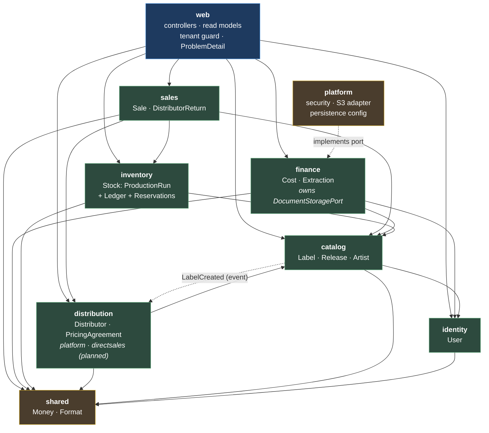

# Backend Assessment and Refactoring Plan

*Assessed 2026-08-13 against `ef98e25`. All claims were verified by running the build, the test suite,
and read-only inspection — see the appendix for how to reproduce them. Code was read first;
`ARCHITECTURE.md` and `docs/PDR-*` were read only afterwards and are reconciled in §5.6.*

**Status: all open questions resolved.** The decisions are recorded in §7 and are already reflected
in §5 and §6. Two of them (Q1 run selection, Q8 Bandcamp) changed the target design rather than just
confirming it.

---

## 1. Current state

**Scale.** 188 main / 99 test Java files; 9,126 main LOC, 10,842 test LOC. Spring Boot 4.0.0 on Java
25. Top-level packages: `catalog`, `distribution`, `inventory`, `sales`, `finance`, `identity`,
`dashboard`, `infrastructure`.

### What works and should be kept

These are load-bearing and correct. The plan preserves all of them.

- **`CommandApi`/`QueryApi` interfaces with package-private implementations.** Applied consistently
  across 8 modules. This is real encapsulation, and it is what makes the plan below incremental
  rather than a rewrite.
- **ID-only references across aggregates.** `ReleaseEntity.labelId`, `ProductionRunEntity.releaseId`,
  `SaleEntity.distributorId` — no `@ManyToOne` between aggregates; join tables are reached through
  explicit native queries (`ReleaseArtistRepository`). PDR-006 proposed this and it was delivered.
  It is the single decision that makes module extraction possible at all.
- **The bidirectional inventory ledger** (`V25`). Positive quantities, direction expressed as
  `from_location_type → to_location_type`. A good model — F5 and F6 describe what is missing from it,
  not what is wrong with it.
- **`InventoryLocation` factory methods** — makes the illegal "DISTRIBUTOR without an id" state
  unconstructible.
- **Flyway discipline.** Forward-only, backfill-then-constrain (`V25`, `V27` both add nullable →
  backfill → `SET NOT NULL`).
- **Testcontainers against real PostgreSQL**, not H2.
- **`@WebMvcTest` slices mocking at the `CommandApi`/`QueryApi` boundary** — these survive the
  refactor unchanged.
- **`AllocateUseCaseTest`** — the one *running* test that mocks at module ports and asserts real
  behaviour. It is the template for §4.2. (`SaleLineItemProcessorTest` is a second one, but it does
  not run — see F11.)

### Findings, ranked by impact on shipping features safely

---

#### F1 — The test suite does not run. 164 tests fail and 15 never run at all on a current Docker.

`./gradlew build` → `318 tests completed, 164 failed`. The suite actually contains **333** tests:
the 15 unaccounted-for ones belong to the six `@Testcontainers`-annotated classes, where container
startup fails in `beforeAll`, so JUnit aborts each class as one failure without ever enumerating its
methods. Classes extending `AbstractIntegrationTest` fail per-method via its static initializer and
so do enumerate. The reported total is therefore an artifact of the failure itself.

Every failure is
`NoClassDefFoundError: Could not initialize class org.omt.labelmanager.AbstractIntegrationTest`,
caused by `IllegalStateException: Could not find a valid Docker environment`
(`AbstractIntegrationTest.java:23`).

Root cause, verified: `build.gradle.kts` pins Testcontainers `1.20.1` (Aug 2024). Its bundled
docker-java negotiates Docker API v1.32. The installed engine is 29.4.1 with `MinAPIVersion=1.40`.

```
$ curl -o /dev/null -w '%{http_code}' --unix-socket /var/run/docker.sock http://localhost/v1.32/info
400
$ curl -o /dev/null -w '%{http_code}' --unix-socket /var/run/docker.sock http://localhost/v1.44/info
200
```

The 400 makes both `UnixSocketClientProviderStrategy` and `DockerDesktopClientProviderStrategy` fail,
so Testcontainers concludes no Docker exists. It reproduces with a fresh Gradle daemon and
`--rerun-tasks`, and will hit any developer on a current Docker Desktop. CI passes only because
`ubuntu-latest` still ships an older engine — **CI is green on a suite that cannot run locally.**

Fix: delete the explicit `1.20.1` pins and let the Spring Boot 4 BOM manage Testcontainers. Note this
is a major upgrade, not just an unpin — the BOM manages **2.0.2**, and Testcontainers 2.x prefixes its
module artifacts (`junit-jupiter` → `testcontainers-junit-jupiter`, and likewise for `postgresql` and
`minio`), so the old coordinates fail to resolve. No test source changes are required.
*(Applied in Phase 0; all 333 tests pass.)*

*Impact: highest. Every other claim about coverage is unverifiable until this is fixed, and no
developer can validate a change locally.*

---

#### F2 — No endpoint enforces tenant ownership.

`label.userId` is never compared to the authenticated principal anywhere in `src/main/java`:

```
$ grep -rn "userId()" src/main/java | grep -v "entity\|Entity"
(no results)
```

Only 4 of 14 controllers reference `@AuthenticationPrincipal`, and they use it solely to *scope a
list* (`getLabelsForUser`, `getArtistsForUser`) — never to *authorise a path variable*. Any
authenticated user can:

- `GET`/`PUT`/`DELETE /api/labels/{id}` — read, modify or delete any label
  (`LabelController.java:105`, `:143`, `:159`)
- `GET /api/costs/{costId}/document` — stream any user's stored invoice PDF from S3
  (`CostController.java:77`), an endpoint not even scoped by label
- every `/api/labels/{labelId}/...` route across sales, returns, releases, distributors, agreements,
  production runs and allocations

`ProductionRunController` and `AllocateController` declare `{labelId}` and `{releaseId}` and ignore
them entirely.

PDR-004 is marked **Accepted**, mandates `user_id` on all tenant-scoped tables, and ships a "Security
Checklist for New Features". None of it was implemented — `cost` has no `user_id` despite the PDR's
own example SQL showing one. Nothing detected this for four months.

*Impact: highest severity. Sequenced at Phase 5 so the guard lands in one place once `web` exists,
rather than in ~40 controllers that Phase 2 would then move.*

---

#### F3 — Every bounded context has a circular dependency, and controllers cause almost all of them.

Cross-package import analysis over all 188 main files:

| | → catalog | → distribution | → inventory | → sales | → finance |
|---|---|---|---|---|---|
| **catalog** | — | 6 | 8 | 2 | 3 |
| **distribution** | 2 | — | 1 | 4 | — |
| **inventory** | 8 | — | — | — | — |
| **sales** | 16 | 11 | 24 | — | 7 |
| **finance** | 2 | — | — | — | — |

Cycles: `catalog ↔ distribution`, `catalog ↔ inventory`, `catalog ↔ sales`, `distribution ↔ sales`,
`finance ↔ infrastructure`.

Re-running the analysis **excluding `*Controller.java`** collapses it to five edges:

| Edge | Where | Nature |
|---|---|---|
| `catalog → distribution` | `CreateLabelUseCase.java:56` calls `distributorCommandApi.createDistributor(...)` | genuine policy — the only real one |
| `catalog → finance`, `sales → finance` | `Money` imported from `finance.domain.shared` by 7 files | misplaced type |
| `inventory → catalog`, `sales → catalog` | `ReleaseFormat` imported from `catalog.release.domain` by 12 files | misplaced type |
| `finance ↔ infrastructure` | `DocumentStoragePort` (in `infrastructure`) returns `finance.shared.RetrievedDocument` | port on the wrong side |
| `finance → identity` | `RegisterCostUseCase.java:16` injects `identity...UserRepository` **directly** | boundary violation |

The last is the worst: a use case in `finance` reaching into another context's Spring Data
repository, bypassing its `api/` package. `ARCHITECTURE.md` forbids it in bold ("**NEVER** inject
repositories from other modules/bounded contexts") and nothing checks.

The controller-caused edges come from page-shaped composite responses. `ReleaseController` (344
lines, the largest file) injects **8 APIs spanning 5 contexts** to build one JSON document.
`DistributorController` injects 8 across 5. `LabelController` injects 5 across 3.

*Impact: high. This is why a change in `inventory` can break `catalog`'s tests, and why no module can
be reasoned about — or tested — in isolation.*

---

#### F4 — Run selection silently breaks sales and returns across multiple pressings.

`SaleLineItemProcessor.validateAndAdd` and `ReturnLineItemProcessor.validateAndAdd` both resolve the
production run with `findMostRecent(releaseId, format)`
(`findTopByReleaseIdAndFormatOrderByManufacturingDateDesc`), then check availability **against that
run only**: `getCurrentInventory(productionRun.id(), distributorId)`.

With two pressings of the same release + format:

- A distributor holding 300 units from pressing #1 can sell **zero** the moment pressing #2 is
  created — availability is checked against #2, which has 0 allocated to them. They get
  `Insufficient inventory: requested 50 but only 0 available`.
- The same rejection blocks returns of pressing #1 stock.
- When a sale *does* pass, the `SALE` movement is written against the newest run, so per-run stock
  figures drift permanently and never self-correct.

No test creates two runs of the same release + format, which is why this is invisible. Per-run
tracking is load-bearing — `pricing_agreement` is keyed on `(distributor_id, production_run_id)` —
so it cannot simply be collapsed.

**Resolved by Q1: FIFO across runs.** A line item draws from the oldest run the distributor still
holds stock in, splitting across runs when one is short; ledger attribution becomes correct. No
request change — but a sale that spans two pressings is attributed to both, which `GET
/releases/{id}/sales` listed twice until 4a deduped it.

*Impact: high, and it is a correctness bug rather than a design preference.*

---

#### F5 — The inventory balance rule is duplicated, inconsistent, and computed in memory.

`production_run.quantity` is manufactured stock that is **not** recorded as a movement, so warehouse
stock is not `Σ movements` — it is `run.quantity + Σ movements`. Callers apply that correction by
hand, in two places:

- `AllocateUseCase.java:47` — `int available = run.quantity() + warehouseDelta;`
- `ProductionRunController.java` (`withAllocation`) —
  `int warehouseInventory = run.quantity() + inventoryMovementQueryApi.getWarehouseInventory(run.id());`

Meanwhile `getWarehouseInventory` is *named* and *documented* as an absolute figure ("Calculates the
current warehouse inventory for a production run") while returning a delta that is normally negative.
Any third caller that trusts the name gets a wrong answer. The aggregate's core invariant lives in a
controller.

Every balance query also loads the full movement history into the JVM and sums it in Java
(`InventoryMovementQueryService.movementsFor` → `sumQuantityTo`/`sumQuantityFrom`).
`ReleaseController` calls four such queries **per production run**, and `buildReleaseSales` adds one
sale query per run — an N+1 that grows with the ledger.

There is no locking on the read-check-write in `SaleLineItemProcessor.validateAndAdd`, so two
concurrent sales can both pass the sufficiency check and oversell.

*Impact: high.*

---

#### F6 — Bandcamp sales cannot be recorded at all.

Every Bandcamp code path is reserve (`WAREHOUSE → BANDCAMP`, typed `ALLOCATION`), cancel
(`BANDCAMP → WAREHOUSE`, typed `RETURN`), or read (`getBandcampInventory`). There is **no**
`BANDCAMP → EXTERNAL` path: `RegisterSaleUseCase.determineDistributor` only ever resolves a
`Distributor`, and Bandcamp is not one.

So when a Bandcamp order is sold and shipped, the operator can only leave the reservation standing
(units look like they still exist) or cancel it (units return as if unsold). Either way the ledger
diverges from reality and the revenue is never recorded.

The underlying modelling error, confirmed with the domain: **Bandcamp stock never leaves the label's
warehouse — the label ships it.** Modelling the earmark as a custody transfer to a pseudo-location
claims units moved somewhere they never were, which is also why a stock-take won't reconcile (the
system says 400 when 500 are on the shelf). PDR-007's own definition of a platform is one that sells
on the label's behalf with *"no physical inventory held"* — so `LocationType.BANDCAMP` contradicts the
very PDR it was meant to implement.

**Resolved by Q8: reservation against warehouse stock**, not a location. See §5.1.

*Impact: high — a functional gap, not just a modelling one.*

---

#### F7 — Error handling is broken and inconsistent.

`GlobalExceptionHandler` is a `@ControllerAdvice` whose handlers **return Thymeleaf view names**:

```java
@ExceptionHandler(EntityNotFoundException.class)
public String handleEntityNotFound(..., Model model, HttpServletResponse response) {
    response.setStatus(HttpStatus.NOT_FOUND.value());
    model.addAttribute("message", exception.getMessage());
    return "error/404";
}
```

Thymeleaf was removed in `0583481` — no starter, no `templates/`, no `static/`.
`EntityNotFoundException` is thrown from 12 files across `sales` and `distribution`; each now hits a
handler that cannot resolve its view.

Around it, controllers have grown ad-hoc `@ExceptionHandler`s returning an **empty body**
(`SaleController.java:156`, `ReturnController.java:168`, `AgreementController`, `AllocateController`).
An `ErrorResponse` record exists but is used only by the SPA auth handlers. Spring Boot 4's native
RFC 9457 `ProblemDetail` is unused. Only 8 assertions in the whole suite check a 404.

Invoice extraction is the sharpest case: `POST /api/costs/extract` returns **200 OK with an all-null
body** whether the parser is unreachable, returns 500, returns 401, or the PDF genuinely has nothing
extractable — `ExternalInvoiceParserAdapter.extract` catches `Exception` and returns
`ExtractedInvoiceData.empty()`. `hasAnyData()` exists to distinguish those cases, is tested four ways,
and is **called by nothing in production**.

Also stale from the same migration: `spring.mvc.hiddenmethod.filter.enabled: true`.

*Impact: medium-high. Clients cannot distinguish "not found" from "server broke", and a broken
integration is indistinguishable from a blank invoice.*

---

#### F8 — Checkstyle cannot fail the build. 499 violations are outstanding.

`config/checkstyle/checkstyle.xml` sets `severity` to `warning` (line 22). CI runs
`./gradlew checkstyleMain checkstyleTest` and is structurally incapable of failing:

```
BUILD SUCCESSFUL
build/reports/checkstyle/main.xml  errors: 228
build/reports/checkstyle/test.xml  errors: 271
```

The breakdown matters — this is not 499 cosmetic issues:

| Count | Rule | Nature |
|---|---|---|
| 327 | `CustomImportOrder` | pure formatting, machine-fixable |
| 117 | `LineLength` | pure formatting, machine-fixable |
| **22** | **`PackageName`** | **real** — `sales/distributor_return` fails `^[a-z]+(\.[a-z][a-z0-9]*)*$` |
| 33 | `NeedBraces`, `AvoidStarImport`, `MethodName`, misc | small, genuine |

The ruleset is otherwise purely cosmetic and encodes zero architectural rules, so none of F2–F6 could
ever be caught by it.

*Impact: medium. A lint gate that cannot fail is worse than none — it reads as enforcement.*

---

#### F9 — Package structure and layering conventions have drifted.

- **The persistence sub-package is named two different things.** `catalog`, `finance`, `sales` use
  `infrastructure/`; `distribution`, `inventory`, `identity` use `persistence/`. `ARCHITECTURE.md`
  specifies `persistence/`.
- **`dashboard` is a top-level package**, but `ARCHITECTURE.md` lists it under `infrastructure/`, and
  its test lives at `src/test/.../infrastructure/web/dashboard/` — a package that does not exist in
  main.
- **View DTOs live in `api/` packages**, which `ARCHITECTURE.md` explicitly forbids:
  `catalog/release/api/ReleaseSaleView.java`, `TrackView.java`,
  `distribution/distributor/api/AgreementView.java`, `inventory/api/*View.java`.
- **Two `@Transactional` annotations in use.** `jakarta.transaction.Transactional` in 5 files (all
  `catalog`), `org.springframework...Transactional` in 20. Only 3 uses of `readOnly`.
- **`InsufficientInventoryException`** sits at `inventory/` root, not in an `api/` package, despite
  crossing into `sales`.

*Impact: medium. Each is small; together they mean the stated conventions are advisory.*

---

#### F10 — Validation-by-side-effect in pricing agreements.

`AgreementCommandService.create` and `.update` each construct a `PricingAgreement` and **discard it**,
purely to trigger the compact constructor's validation:

```java
new PricingAgreement(null, distributorId, productionRunId, unitPrice, commissionType, commissionValue, null);

PricingAgreementEntity entity = new PricingAgreementEntity(distributorId, productionRunId, ...);
```

The invariant is in the right place but is invoked as a statement with no result. Any tidy-up that
removes the "unused" expression silently deletes the validation.

*Impact: medium. A correct rule held in place by an accident of style.*

---

#### F11 — Smaller defects worth naming

- **A committed test that never runs.** `src/test/java/.../sales/sale/application/SaleLineItemProcessorTest.java`
  sits at the **repo root**, not under `backend/`, left behind by `eb39517 refactor: restructure
  project as monorepo`. Gradle roots at `backend/`, so it is never compiled — its 2 tests are not
  among the 318. It is a good boundary-respecting unit test of exactly the code in F4, and it has
  been dead since the restructure. Move it; it will need updating for FIFO.
- **`POST /api/auth/register` is consumed but undocumented.** `e2e/login.spec.js:14` calls it; it is
  absent from `contracts/openapi.yaml`.
- **Duplicate API method by design.** `InventoryMovementQueryApi` declares both
  `findByProductionRunId` and `getMovementsForProductionRun`, documented as "Alias for … with a more
  descriptive name".
- **Ledger entries are hard-deleted.** Editing a sale calls `deleteMovementsByReference(SALE, saleId)`
  then re-inserts (`UpdateSaleUseCase.java:70`). An append-only ledger mutated by DELETE loses its
  audit value; compensating movements would preserve it.
- **Deleting a distributor orphans its movements.** `V25` dropped `inventory_movement.distributor_id`
  and its FK; `DistributorCommandService.delete` does no check, so rows survive pointing at a dead id.
- **Three unused `MovementType` values.** `TRANSFER_IN`, `TRANSFER_OUT`, `ADJUSTMENT` are written by
  nothing. `TRANSFER_*` are structurally obsolete post-`V25` (direction now lives in `from`/`to`). The
  only reference is `MovementTypeTest`, which asserts the enum has six values — a test whose sole
  function is to pin dead code.
- **`RETURN` is overloaded.** `CancelBandcampReservationUseCase` records `MovementType.RETURN` for a
  reservation cancellation, and `deleteMovementsByReference(RETURN, id)` keys off that same value.
  (Dissolved by Q8 — cancellations stop being movements.)
- **`spring.flyway.baseline-on-migrate: true`** will silently baseline an unrecognised database
  instead of refusing to start.
- **Copy-pasted request records.** `LabelController.CreateLabelRequest` and `UpdateLabelRequest` are
  byte-identical including both helper methods; same pattern in `ReleaseController`.

---

## 2. Database schema

**Verdict: fit for purpose. Keep it and evolve it — six migrations, no reset.**

32 Flyway migrations, all forward-only, with a genuinely careful style: `V25` and `V27` both add
columns as nullable, backfill, then apply `SET NOT NULL`. `V19` renames a table and correctly drops
and recreates dependent FKs and indexes. `V31` cleanly retires `channel_allocation` after `V26`
emptied it. Better migration hygiene than most codebases of this age.

Indexing is reasonable: composite indexes on the movement location columns (`V25`), on
`(movement_type, reference_id)` for the reversal query, and on every FK used for lookup.

### Defects

1. **Tenancy is absent from the schema.** Only `label.user_id` and `artist.user_id` exist, both
   nullable. `cost`, `sale`, `distributor_return`, `production_run`, `inventory_movement`,
   `pricing_agreement` have none — `cost` lacks one despite PDR-004's own example SQL showing it.
   With no application check either (F2), there is no isolation at any level.
2. **`inventory_movement` locations have no referential integrity.** `V25` dropped `distributor_id`
   and its FK for polymorphic `from_location_type`/`from_location_id` pairs.
3. **`sale.channel` duplicates `distributor.channel_type`.** Two sources of truth that can diverge;
   `V27`'s three-step backfill exists precisely because of it. `channel` is derivable and should go.
4. **`app_user.created_at` is `TIMESTAMP`, not `TIMESTAMPTZ`** — inconsistent with every other
   timestamp in the schema.
5. **No unique constraint on `production_run (release_id, format)`.** Correct as it stands — multiple
   pressings are legitimate — but F4 shows the code assumed otherwise.
6. **No representation for reserved stock** (Q8), so the earmark had to be faked as a location.

### Recommendation

| | Migration | Phase |
|---|---|---|
| V32 | `app_user.created_at` → `TIMESTAMPTZ`; drop `spring.flyway.baseline-on-migrate` | 0 |
| V33 | Insert one `PRODUCTION` movement (`EXTERNAL → WAREHOUSE`, `quantity = production_run.quantity`) per existing run, so stock becomes uniformly `Σ in − Σ out`; add a partial unique index making "at most one manufacture per run" a schema rule | 4a |
| V34 | Create `stock_reservation`; **convert** existing `WAREHOUSE → BANDCAMP` movements into reservation rows (net of cancellations) and delete both movement legs; drop `LocationType.BANDCAMP` usage | 4b |
| V35 | Make `sale.distributor_id` nullable, add the counterparty discriminator, repoint direct sales at `WAREHOUSE → EXTERNAL`, **delete the matching `WAREHOUSE → DISTRIBUTOR(direct)` ALLOCATION legs**, delete the pseudo-distributors (Q9) | 4b |
| V36 | Add `user_id` to `cost`; add `label_id` to `production_run`, `inventory_movement`, `pricing_agreement`, `stock_reservation`; backfill via joins; `NOT NULL` + FK + index | 5 |
| V37 | Drop `sale.channel` (derive from the distributor / platform) | 5 |

`stock_reservation` shape, confirmed at Phase 4 (Q10):

```sql
CREATE TABLE stock_reservation (
    id                BIGSERIAL PRIMARY KEY,
    production_run_id BIGINT NOT NULL REFERENCES production_run(id) ON DELETE CASCADE,
    purpose           VARCHAR(30) NOT NULL,   -- 'BANDCAMP' today; becomes a platform FK when
    quantity          INT NOT NULL CHECK (quantity > 0),  -- distribution/platform lands (Q4)
    created_at        TIMESTAMPTZ NOT NULL DEFAULT NOW()
);
```

`purpose` rather than a platform FK keeps Phase 4 from having to build PDR-007's platform module
first; it becomes a foreign key when that module lands (Q10).

---

## 3. REST contract

**Verdict: not fit for purpose as written, but the fix is cheap now and will not be later. Reshape in
Phase 2.**

### What is actually true

`contracts/openapi.yaml` is 111 lines documenting **three** operations: `POST /login`, `POST /logout`,
`GET /api/session`. The backend serves roughly **forty** across 14 controllers.

The consumer surface is four endpoints — the three above plus `POST /api/auth/register`, called by
`e2e/login.spec.js:14` and documented nowhere:

```
$ grep -rhoE "['\`\"]/api/[^'\`\"]*" frontend/src | sort -u
'/api/session
```

`frontend/src/api/auth.js` is the entire API layer. `frontend/src/pages/` contains `LoginPage.jsx`
and an empty `HomePage.jsx`. Confirmed (Q2): nothing else calls this API.

So the spec is *nearly* accurate for its consumer and *entirely* ignorant of the backend — as its own
description admits ("Add endpoints here as they are introduced during the Thymeleaf → React
migration"). The root `CLAUDE.md` claim that it is "the source of truth" is aspirational. Nothing
verifies it in either direction, and `springdoc-openapi` emits a competing spec at `/v3/api-docs`.

### Why this matters more than it looks

The ~40 endpoints were converted mechanically from Thymeleaf controllers between `2731e15` and
`a0095cb` (16 commits, all in the last feature branch). Their response shapes are **fossilised page
models**:

- `LabelDetailResponse` bundles a label with its releases, the user's artists, and its distributors —
  because the old page rendered all four.
- `ReleaseDetailResponse` bundles artists, tracks, costs, production runs with per-distributor
  inventory, movement history, distributors, sales, and a total — 12 fields from 5 bounded contexts.
- `DistributorDetailResponse` bundles sales, returns, and enriched agreements.

**These page models are the direct cause of F3.** Every wrong-direction module dependency outside
`CreateLabelUseCase` exists to populate one of them, and they are the cause of F5's N+1. Because
nothing consumes them, changing them costs nothing today.

### Recommendation

Keep `openapi.yaml` as the source of truth, but make it **enforceable rather than aspirational** — do
not generate code from it; verify against it. In Phase 2:

1. **Replace page-shaped composites with resources.** `GET /api/labels/{id}` returns a label;
   releases, artists and distributors become sub-resource or filtered collection endpoints. Where a
   client genuinely needs a bundle, that is a named read model in `web/` built by one query.
2. **Adopt RFC 9457 `ProblemDetail`** for all errors, replacing the empty-bodied handlers and the
   broken Thymeleaf advice (F7).
3. **Fix extraction semantics (Q7).** Parser unreachable / 5xx / 401 → `502` `ProblemDetail`, so a
   broken integration is visible. Parse succeeded but found nothing → `200` with nulls and an explicit
   `extracted: false`, finally giving `hasAnyData()` a caller.
4. **Collapse `CostController`.** Six mappings that are three operations × two owner types become one
   collection with an owner discriminator.
5. **Scope `/api/costs/{costId}/document` under its label** and add the ownership check (F2).
6. **Document `POST /api/auth/register`** and add a Bandcamp reservation/sale surface (F6, Q8).
7. **Add a conformance test**: boot the app, fetch `/v3/api-docs`, assert every path/method/status in
   `openapi.yaml` exists in the live spec — and, once migration completes, that no live path is
   undocumented. This is what stops the two drifting again.

---

## 4. Testing

### 4.1 Audit of what exists today

**It does not run.** 164 tests fail and 15 never run on a current Docker (F1). Everything below
describes the suite as it would be with F1 fixed — a full 333 tests.

**Shape — an inverted pyramid.** PDR-003 specifies a pyramid with unit tests at the base.

| Level | Classes | Reality |
|---|---|---|
| Full Spring context + Postgres (`@SpringBootTest` / `AbstractIntegrationTest`) | 47 | the base |
| `@WebMvcTest` slice | 13 | |
| Plain JUnit, no Spring | 20 | mostly trivial (below) |
| `@DataJpaTest` | **0** | persistence is tested through the full context |

**Coverage claimed vs. actual.** Much of the "unit" tier asserts that a record returns its
constructor arguments. `SaleLineItemTest` is the clearest case:

```java
var expectedTotal = new Money(new BigDecimal("45.00"), "EUR");
var lineItem = new SaleLineItem(1L, 100L, ReleaseFormat.VINYL, quantity, unitPrice, expectedTotal);
assertThat(lineItem.lineTotal().amount()).isEqualByComparingTo(new BigDecimal("45.00"));
```

It is named `lineTotal_calculatesCorrectly` and calculates nothing — the expected value is passed in
and read back. The real multiplication lives in `SaleLineItemEntity`'s constructor and is not
unit-tested at all. `CostTest`, `InventoryMovementTest` and `MovementTypeTest` share the shape; the
last exists only to assert an enum has six values, three of them dead (F11).

**What the suite cannot reach:**

- **Authorization** — nothing asserts tenant isolation, consistent with there being none (F2). Not one
  test would fail if `LabelController` were made deliberately more permissive.
- **Multiple pressings** — no test creates two runs of the same release + format, which is why F4 is
  invisible.
- **Concurrency** — no test of two concurrent sales against the same stock, so F5's oversell race is
  invisible.
- **The global error path** — nothing renders `GlobalExceptionHandler`, which is why F7 survived the
  Thymeleaf removal.
- **The REST contract** — nothing compares the running app to `openapi.yaml`.

**Speed.** Not currently measurable — the suite aborts in ~10s. One static `PostgreSQLContainer` is
shared across all `AbstractIntegrationTest` subclasses (good), but 47 classes will produce several
Spring context variants, and isolation uses `deleteAll()` in `@BeforeEach`
(`SaleRegistrationIntegrationTest:66`) rather than transactional rollback — real deletes, and
order-sensitive.

**Would they survive the proposed refactor?**

- **`@WebMvcTest` slices — yes.** They mock `CommandApi`/`QueryApi` (`LabelControllerTest` uses five
  `@MockitoBean`s at exactly that boundary). Those interfaces survive; the tests move with their
  controllers into `web/`.
- **`*IntegrationTest` classes — largely no.** They `@Autowired` other modules' repositories directly:
  `SaleRegistrationIntegrationTest` injects `DistributorRepository`, `ProductionRunRepository` and
  `InventoryMovementRepository` alongside `SaleCommandApi`. Any repository move breaks them. **That
  coupling is itself why the boundaries cannot be enforced today** — the tests depend on the
  violations.
- **`AllocateUseCaseTest` — yes, and it is the model.** Constructs the subject directly, mocks the two
  inventory APIs, asserts the recorded movement.

### 4.2 Target strategy

| Level | Scope | What it tests | What it must not touch |
|---|---|---|---|
| **Domain unit** (plain JUnit) | one aggregate, no Spring, no JPA | invariants and calculations: balance never negative, FIFO draw order, reserved ≤ on-hand, sale total = Σ line totals, commission validity, line-item arithmetic | Spring, database, other modules |
| **Use-case unit** (Mockito) | one use case, peers mocked at `api/` | orchestration and decisions — the `AllocateUseCaseTest` pattern | Spring context, database |
| **Persistence** (`@DataJpaTest` + Testcontainers) | one module's entities and repositories | mappings, custom queries, cascade/orphan removal, aggregate SQL | HTTP, other modules |
| **Module integration** (`@SpringBootTest`, narrowed) | one module through its `api/`, peers as real beans | cross-module contracts; the sale → inventory transaction | HTTP layer, view shaping |
| **API / contract** (`@WebMvcTest` + one conformance test) | one controller, all `api/` mocked | routing, serialization, status codes, `ProblemDetail` bodies, **tenant guard**, conformance to `openapi.yaml` | business logic |
| **E2E** (Playwright) | whole app | login and one critical journey | validation rules, API contracts |

Rebalancing target: 47 full-context classes drop to roughly a dozen module-integration classes;
persistence moves to `@DataJpaTest`; record-echo tests are replaced by real domain unit tests once
domain types gain behaviour (Phase 4).

**Tests the decisions oblige us to add:**

- multi-pressing FIFO: allocate across two runs, sell spanning both, assert per-run attribution (Q1)
- reservation invariants: reserved ≤ on-hand; allocation sees `available`, not on-hand; Bandcamp sale
  decrements the reservation and records `WAREHOUSE → EXTERNAL` (Q8)
- concurrent sales cannot oversell (F5)
- extraction returns 502 on parser failure and `extracted:false` on an empty parse (Q7)

**Mechanical enforcement** — every boundary rule gets an executing test, not a document:

1. **`ApplicationModules.verify()`** (Spring Modulith) — no cycles between top-level modules, no
   access to any module's non-`api/` internals. Derived from package structure plus one
   `package-info.java` per module; nothing to hand-maintain.
2. **ArchUnit**, for the two rules Modulith cannot express: no `jakarta.persistence.*` import inside
   any `..domain..` package; no `*Controller` outside `web`.
3. **OpenAPI conformance test** — live `/v3/api-docs` vs `contracts/openapi.yaml`.
4. **Checkstyle at `severity=error`** (Q5 — burned down, not baselined).

---

## 5. Target architecture

### 5.1 Bounded contexts, derived from behaviour

| Context | Aggregate(s) | Invariants it owns |
|---|---|---|
| **Identity** | `User` | email is unique; password always stored encoded |
| **Catalog** | `Label`, `Release` (with `Track`), `Artist` | a release belongs to exactly one label; ≥1 track; contiguous track positions |
| **Distribution** | `Distributor`, `PricingAgreement`; later `Platform`, `DirectSales` (Q4) | every distributor is an external counterparty *(replaces "exactly one `DIRECT` distributor per label", retired by Q9)*; one agreement per (distributor, run); commission valid for its type |
| **Inventory** | **`Stock`** — `ProductionRun` + its movement ledger + its reservations | every movement is a conserved transfer of a positive quantity between two locations; **no location balance is ever negative**; **reserved ≤ on-hand**; draws follow FIFO across runs |
| **Sales** | `Sale`, `DistributorReturn` | ≥1 line item; total = Σ line totals; attributed to exactly one counterparty; counterparty and channel immutable after registration |
| **Finance** | `Cost`, invoice extraction | gross = net + VAT; a cost has exactly one owner |

**Two substantive domain changes**, both settled in §7.

**(a) `ProductionRun` and `InventoryMovement` are one aggregate, not two.** They are currently
separate modules whose shared invariant is enforced nowhere and duplicated three times (F5).
Recording manufacture as a `PRODUCTION` movement makes every balance uniformly `Σ in − Σ out`,
computable in one aggregate SQL query, with one owner:

```java
// inventory/domain/StockLedger.java — the rule, in one place, unit-testable without Spring
// A ledger is one location's holding of one release+format, built by
// ProductionRunQueryApi.lockedLedgerAt; the location and the release are the question asked of the
// builder, not state the ledger carries around.
int onHand();                          // Σ in − Σ out, never caller-corrected
int available();                       // onHand − reserved (a WAREHOUSE ledger only; 4b —
                                       // nothing is reserved until V34)
List<RunDraw> drawFifo(int quantity);  // oldest pressing first, split when one is short
StockLedger minus(List<RunDraw> draws); // what the next line item of the same sale sees
```

`drawFifo` returns the per-run split (Q1) instead of a single run id — this is the API change F4
forces, and it is why `SaleLineItemProcessor` and `ReturnLineItemProcessor` both change in Phase 4.
`minus` is what stops two line items for the same release each drawing against the opening balances.

**(b) Reserved stock is a reservation, not a location (Q8).** Bandcamp units never leave the
warehouse, so `LocationType` reduces to `WAREHOUSE | DISTRIBUTOR(id) | EXTERNAL`, and the ledger goes
back to being a pure custody ledger:

```
on-hand   500   physically in the building
reserved  100   earmarked for Bandcamp
available 400   allocatable to distributors

reserve : stock_reservation +100        (no movement — nothing moved)
cancel  : stock_reservation -100        (no movement)
sale    : WAREHOUSE -> EXTERNAL, 5      (label ships) + reservation -5
```

This deletes `LocationType.BANDCAMP`, `getBandcampInventory`, `CancelBandcampReservationUseCase`, the
`BANDCAMP` branch in `AllocateController.resolveToLocation`, and the `RETURN` overload — and it closes
F6, since a Bandcamp sale becomes an ordinary warehouse sale.

### 5.2 Module map and dependency rules



**Rules.**

1. **Dependencies point downward only.** No cycles. Enforced by `ApplicationModules.verify()`.
2. **`api/` is the only public surface.** Public: the `CommandApi`/`QueryApi` interfaces, the domain
   records they return, and the exceptions they throw. Internal: `application/`, `domain/` internals,
   `persistence/`. This is the existing convention; it just becomes checked.
3. **Never inject another module's repository.** Already in `ARCHITECTURE.md`; the verifier makes it
   real (`RegisterCostUseCase` is the current violation).
4. ~~**`web` is the only module allowed to depend on several domain modules at once.**~~
   **Withdrawn during Phase 2, after being implemented and reverted.** The justification — that it
   "deletes every wrong-direction edge in F3's table" — was true but not causal: splitting the
   page-shaped composites (§3.1) is what removed them. With the release resource no longer carrying
   its costs, runs, distributors and sales, twelve of fourteen controllers had only downward
   dependencies; the two that did not were resolving ids to display names, which was the actual
   defect. A top-level `web` module bought a layer split at the cost of every feature living in two
   trees. **Controllers live in their own module, in a `web/` sub-package** — not `api/`, since rule
   2 does not list controllers among what `api/` publishes and Phase 3 marks `api/` as a named
   interface. Cross-context read-model composition is still allowed in a controller, but only
   through edges its own module already has.
5. **Ports belong to the domain module that needs them; adapters live in `platform`.**
   `DocumentStoragePort` moves into `finance`; `S3DocumentStorageAdapter` implements it from
   `platform`. The direction becomes `platform → finance`, one way.
6. **`shared` holds only dependency-free value types** — `Money`, `Format` (today's `ReleaseFormat`).
   Nothing with context-owned behaviour goes there.
7. **`ChannelType` is a shim** (Q4). PDR-007's `platform` and `directsales` modules remain the plan,
   so `sales` must reach `ChannelType` through `distribution`'s `api/` rather than importing it at 8
   sites as it does today — otherwise those are 8 call sites the future split has to unpick.

### 5.3 Inter-module communication — and the event-driven verdict

**Verdict: synchronous `api/` calls everywhere. The one domain event is retired by Q9.**

**The one event was `LabelCreated`.** Phase 1 broke catalog's last cycle by having `CreateLabelUseCase`
publish it and `DirectSalesProvisioner` subscribe, provisioning the per-label "Direct Sales"
distributor. The reasoning held that the rule was a policy that would gain subscribers rather than
lose them. Q9 disproves that: retiring the pseudo-distributor removes the provisioner, and with it the
event's only subscriber. **Phase 4b deletes the event, its publisher and `DirectSalesProvisioner`
together** — an event with no subscribers is a cycle-breaker with nothing left to break.

The mechanism was never the problem, and the judgement stands should a genuine policy appear:
`ApplicationEventPublisher` + `@TransactionalEventListener` in the same transaction, no queue, no
outbox. It simply has no instance left in this codebase.

**Where events would actively hurt.** Sale registration → inventory must stay a direct synchronous
call. The sale is *rejected* when stock is insufficient (`InsufficientInventoryException`); that is a
synchronous invariant, not a notification. An event would convert a transactional check into an
eventual-consistency problem — partial sales, compensating logic, a reconciliation job — for **zero**
decoupling benefit in a single-process, single-database monolith. The same applies to returns, to the
movement reversal in sale update/delete, and to reservation consumption. `sales → inventory` is 24
imports of genuine, ordered, transactional dependency. Leave it synchronous and explicit.

**Rule of thumb:** an event when the publisher does not care whether anyone listens; a direct call
when the outcome depends on the answer.

### 5.4 Spring Modulith verdict

**Adopt narrowly: `ApplicationModules.verify()` and the generated documentation. Skip the event
publication registry and the module test slices for now. Pair with two ArchUnit rules.**

**Why adopt.** The codebase already has the shape Modulith verifies — top-level package per module,
`api/` public, `application/` package-private — so `@NamedInterface("api")` maps onto the existing
convention with no restructuring. `ApplicationModules.verify()` is a ~10-line test enforcing the
no-cycles and no-internals rules `ARCHITECTURE.md` already states in prose. F3 proves those rules are
violated in five places and nobody noticed for four months; prose is demonstrably not working.
Modulith also derives the dependency matrix from package structure, so there is nothing to keep in
sync when the PDR-007 modules arrive.

**Why not ArchUnit alone.** It could express these rules, but you would hand-maintain the matrix and
the cycle detection, and that file rots exactly like `ARCHITECTURE.md` did.

**Why skip the event publication registry.** It exists so listeners survive a restart, backed by a
table and a scheduler. With one event, one transaction, one process, it buys nothing.

**Why skip `@ApplicationModuleTest` initially.** It bootstraps a partial context per module — useful
eventually, but the immediate win is `@DataJpaTest` slices and real domain unit tests, neither of
which needs it.

### 5.5 What this deliberately does not change

- **No rewrite, of any module.** Earned: the dependency analysis shows five offending edges outside
  controllers, four of them single-file moves. The module skeleton is already right and applied
  consistently across eight modules. The largest behavioural change (§5.1) is three migrations plus
  one class, done in Phase 4 with boundaries already enforced.
- **No new abstractions where the existing ones suffice.** `CommandApi`/`QueryApi` stays.
  `InventoryLocation` stays. The from/to ledger stays. `fromEntity()` stays *except* where a domain
  type gains behaviour and must lose its JPA dependency.
- **No framework, language or build-tool change.** Spring Boot 4 / Java 25 / Gradle throughout.

### 5.6 Reconciliation with the existing documents

**Where the docs match reality.** The module skeleton, the `CommandApi`/`QueryApi` split with
package-private implementations, and ID-only cross-aggregate references are all real and worth
keeping. PDR-006 is still marked "Proposed" but was delivered — mark it Accepted.

**Where the code has drifted.**

- PDR-004 (multi-tenant isolation) is Accepted and **entirely unimplemented** (F2).
- "NEVER inject repositories from other modules" — violated by `RegisterCostUseCase` (F3).
- "Avoid bidirectional module dependencies" — violated between all four domain contexts (F3).
- "The `api/` package does not contain view-specific DTOs" — violated by six `*View` records (F9).
- `ARCHITECTURE.md` places `dashboard` under `infrastructure/`; it is top-level (F9).
- `ARCHITECTURE.md`'s worked example for encapsulating side effects is built around
  `AllocationCommandApiImpl`/`ChannelAllocation` — a module deleted in `V31`.
- `ARCHITECTURE.md` says domain objects should hold business rules and offers
  `ProductionRun.canAllocate(...)` as the example. `ProductionRun` is a pure data record; the rule
  lives in `AllocateUseCase` and a controller (F5). The doc's own example is aspirational.
- **PDR-007 classifies Bandcamp as a platform holding no physical inventory — and the code modelled
  it as an inventory location.** Q8 resolves this in PDR-007's favour (F6).

**Where the documented design is a bad idea regardless of the code.**

- **"Compose composite responses in the controller — not in a service or use case."** This rule
  produced `ReleaseController` (344 lines, 8 APIs, 5 contexts, N+1) and is the direct cause of every
  bidirectional dependency the *same document* forbids two sections earlier. The rules conflict and
  the composition rule loses: composition moves into `web`, a module with declared dependencies rather
  than a licence for any controller to reach anywhere.
- **`fromEntity()` on domain records.** Accepted in `ARCHITECTURE.md` as a pragmatic trade-off. It
  forces `domain → persistence`, which is why no domain type can be unit-tested without JPA and why
  the unit tier degenerated into record echoes (§4.1). Keep it for pure-data records; drop it for any
  type that gains behaviour, starting with `StockLedger`. The ArchUnit rule makes the boundary
  permanent once crossed.
- **`CommandApi` → `*ApiImpl` → `*UseCase` for CRUD.** `LabelCommandApiImpl` is three lines of
  delegation per method with no logic. `ARCHITECTURE.md` already documents a "simplified structure"
  for exactly this; it simply is not applied. Fold into Phase 2 where convenient.

---

## 6. Phased migration plan

Every phase leaves `./gradlew build` green and the app deployable.

---

### Phase 0 — Make the build tell the truth ✅ *done, branch `feature/backend-phase-0`*

**What actually differed from the plan below**, all verified:

- **Testcontainers was a major upgrade, not an unpin.** The BOM manages 2.0.2 and 2.x prefixes its
  module artifacts, so three of four coordinates had to change. No test sources needed editing.
- **The suite has 333 tests, not 318** — see F1. Final count is 336 (333 + 2 recovered + 1 new).
- **Checkstyle's `LineLength` and `Indentation` were removed rather than burned down** (a deviation
  from Q5). google-java-format and checkstyle disagreed irreconcilably: the formatter will not split
  long string literals its own continuation indent pushed past 100 columns, and checkstyle does not
  model a switch *expression* wrapped as an assignment continuation. Keeping both meant the gate
  could never go green. Spotless now owns layout and `spotlessCheck` runs as part of `check`;
  checkstyle keeps naming, braces, imports and javadoc. One source of truth per concern.
- **`MethodName` was relaxed** to `^[a-z][a-zA-Z0-9_]*$` so test data builders can keep the
  article-prefixed convention (`aLabel()`, `aRelease()`), rather than renaming six well-named methods
  to satisfy a pattern.
- **`PackageName` is suppressed for `sales/distributor_return`** until Phase 2 renames it, so those
  files churn once rather than twice.

**Changes.** Drop the five Testcontainers `1.20.1` pins; let the BOM manage them (F1). Move
`src/test/.../SaleLineItemProcessorTest.java` into `backend/` so it compiles (F11). Delete
`GlobalExceptionHandler`; replace with a `ProblemDetail`-based `@RestControllerAdvice` mapping
`EntityNotFoundException` → 404 and `IllegalArgumentException`/`InsufficientInventoryException` → 400
(F7). Remove `spring.mvc.hiddenmethod.filter`. Add Spotless matching the checkstyle import order; one
mechanical commit clears ~444 violations, hand-fix the ~33 small ones, suppress only `PackageName`
until Phase 2 renames `distributor_return`; set `severity=error` (F8, Q5). `V32`:
`app_user.created_at` → `TIMESTAMPTZ`, drop `baseline-on-migrate`.

**Why first.** Nothing downstream is verifiable while 164 tests cannot run and the lint gate cannot
fail. No structural change — this makes the safety net exist.

**Done when.** `./gradlew build` green locally with Docker running; 335/335 pass (333 once the suite
actually enumerates, plus the two recovered from the orphaned test); a deliberately introduced
checkstyle violation fails the build; a `@WebMvcTest` asserts a 404 `ProblemDetail` body for a
missing sale.

---

### Phase 1 — Extract `shared`, put misplaced types and ports where they belong ✅ *done, branch `feature/backend-phase-1`*

**What actually differed from the plan below**, all verified:

- **The file counts were undercounts.** `Money` touched 30 files, not 7; `ReleaseFormat` touched 64,
  not 12. Both figures counted the import sites, not the call sites that use the bare type name.
- **`RetrievedDocument` and `DocumentUpload` were already in `finance.shared`** — only the port
  needed moving. `DocumentStorageException` moved with it, which the plan did not list: leaving it in
  `infrastructure` would have recreated the cycle the first time `finance` caught a storage failure
  by type. It is now declared on the port's methods.
- **`UserQueryApi` landed in `identity/api/user/`, not `identity/api/`**, matching how `identity`
  nests every other layer under `user/`.
- **The `USER` cost-owner branch had no test at all**, so the boundary fix came with three: two for
  the new query API and one for registering a cost against a user. The last advances the user id
  sequence past the label and release ids, because otherwise validating against the wrong module's
  repository still passes by coincidence.
- **The DIRECT-distributor test the plan asks for already existed** and passes with the listener in
  either transaction phase, so it does not pin atomicity. A second test does: it fails if the
  listener moves to `AFTER_COMMIT`.
- **`UserTestHelper` was added** so `finance`'s tests stop reaching into `identity`'s persistence
  package, matching the existing label and release helpers.

341 tests pass (336 after Phase 0, plus the 5 above).

**Changes**, each its own commit:

- `finance.domain.shared.Money` → `shared.Money` (7 files)
- `catalog.release.domain.ReleaseFormat` → `shared.Format` (12 files)
- `DocumentStoragePort` + `RetrievedDocument` + `DocumentUpload` → `finance`;
  `S3DocumentStorageAdapter` stays in `infrastructure` implementing it
- `RegisterCostUseCase`: replace the injected `UserRepository` with `identity.api.UserQueryApi.exists`
- **the only behaviour change:** `CreateLabelUseCase` publishes `LabelCreated`; a listener in
  `distribution` provisions the Direct Sales distributor

**Why here.** Removes four of five non-controller cycles at near-zero risk, plus the fifth via the one
event that earns it. Phase 3's verifier needs something that can pass.

**Done when.** The cross-package scan shows no cycle outside `*Controller.java`; test outcomes
unchanged except one new test asserting a `DIRECT` distributor exists after label creation.

---

### Phase 2 — Extract `web` and reshape the API 🚧 *in progress, branch `feature/backend-phase-2`*

**What actually differed from the plan below**, all verified:

- **Moves came first, reshaping second.** The plan asks for both in the same commit per controller.
  They cannot be: the release composite cannot shed its `productionRuns` field until that collection
  exists on `ProductionRunController`. Every controller moved on its own commit, then each composite
  was split on its own.
- **Then the `web` module was removed again — see rule 4 above.** Controllers were extracted to a
  top-level `web` as the plan specified, and moved back into their modules once it was clear the
  composite split had done the work rule 4 claimed. The intermediate state was not wasted: it is
  what made the redundancy visible, and the reshaping done while there is what the modules kept.
- **F3 is fully closed and can be checked.** `catalog → catalog, shared`; `sales → catalog,
  distribution, inventory, shared`; `distribution → catalog`; `finance → catalog, identity, shared`;
  `inventory → shared`; `identity → nothing`; and nothing imports `web`. Every arrow points
  downward, so Phase 3's `ApplicationModules.verify()` has something that can pass.
- **The `api/` surface had to be opened first, twice.** `RegisterController` could not move while it
  injected `UserCRUDHandler` (public, in `application/`) and caught an exception from `domain/`; four
  controllers had the same problem with `AppUserDetails`. `UserCommandApi`, `EmailAlreadyExistsException`
  and `AppUserDetails` moved into `identity/api/user/`. Q4's `ChannelType` move exposed the same thing
  in `distribution`, where `Distributor`, `PricingAgreement` and `CommissionType` followed.
- **`src/test/resources/application.yaml` was shadowing the main file, not adding to it.** Same
  classpath name, test resources first — so `spring.mvc.problemdetails.enabled`, `ddl-auto: validate`
  and the multipart limits were absent from every test. Phase 0 turned problemdetails on; no test
  could observe it, and one written against the documented behaviour failed against a correct
  application. Renamed to `application-test.yaml` and activated from a small `application.properties`.
- **The reviews found four ownership regressions the split introduced**, all in the new collections:
  `?distributorId=` and `?releaseId=` filters returned another label's sales, returns and production
  runs, because the bundled responses had resolved the parent once and the collections resolved
  nothing. The check is now `web/LabelScope`, which is also where Phase 5's tenant guard goes. The
  two filtered collections became sub-resources — as sibling `@GetMapping(params=…)` they were
  ambiguous and `?releaseId=4&distributorId=5` was a 500.
- **Bugs fixed that were not on the list:** registration accepted a null email and 500'd on the NOT
  NULL constraint, and raced two concurrent signups into a 500 on the unique index; `PUT`/`DELETE
  /api/artists/{id}` returned 204 for ids that do not exist, so a client believed a no-op update had
  applied; CSRF-rejected 403s had no body; the invoice parser swallowed every transport failure into
  an empty 200, so a dead integration was indistinguishable from a blank invoice.

- **The item endpoints were never scoped either, and predate Phase 2.** `GET`/`PUT`/`DELETE
  /api/labels/1/sales/{saleOwnedByLabel2}` read, mutated and deleted another label's sale;
  same for returns; `POST`/`DELETE` on production runs ignored the label and release in the
  path entirely. `SaleCommandApi.updateSale` takes a sale id and nothing else, so nothing
  downstream could catch it. All six now check, through the same `LabelScope`.

**Done when — status.** No `*Controller` outside `web` ✅. No `PackageName` suppressions ✅.
`openapi.yaml` documents all 31 paths and 52 operations — 50 controller mappings plus `/login`
and `/logout`, which Spring Security's form-login filter serves rather than a controller ✅.
*(Counts corrected in Phase 3, where the conformance test made them checkable; the last Phase 2
commit added an endpoint without updating this line.)*
But *matching* is by hand, and the review caught several places where the document and the code
disagreed (`Money` carries a `currency` field; `AgreementView.displayCommission` is a record
method Jackson never serialises; the cost document is served with its stored content type). The
conformance test that boots the app and diffs `/v3/api-docs` is Phase 3 — until it exists, this
column is a claim, not a check.

**Still open — `distribution` cannot validate a `productionRunId`.** `PricingAgreement` holds one,
and `POST .../agreements` checks that the distributor belongs to the label but never that the
production run does. It could not: the check needs inventory, and `distribution → inventory` is not
on §5.2's map. Previously this was masked — a cross-label run rendered as the other label's release
name — and returning the raw id makes it visible: the client gets an id that will not appear in
`/api/labels/{labelId}/production-runs`. Three ways out, none free: allow `distribution → inventory`
(an admission that pricing genuinely references pressings); move agreements into `inventory`; or
have `inventory` own a "price for this run" concept. Worth settling in Phase 4, which is already
rebuilding the inventory aggregate.

**Still open.** User-owned costs (`CostOwner.user`) are reachable under no endpoint: the
document route used to serve them regardless of owner, and scoping it under a label closed
that. Nothing creates them over HTTP and `CostQueryApi.getCostsForUser` has no caller, so this
is a decision to take, not a regression to undo — give them a surface or delete the concept.

**Changes.** Move every `*Controller`, its nested request/response records, and the `*View` DTOs into
`web/` — **one controller per commit**. Rename `sales/distributor_return` → `sales/distributorreturn`
(clears the 22 `PackageName` suppressions). In the same commits, reshape per §3: composites →
resources, `ProblemDetail` everywhere, extraction 502/`extracted:false` (Q7), `CostController`
collapsed, cost-document endpoint scoped, `/api/auth/register` documented. Route `sales`' 8
`ChannelType` imports through `distribution`'s `api/` (Q4). Update `contracts/openapi.yaml` as each
endpoint lands. `@WebMvcTest` slices move with their controllers.

**Why here.** Deletes every remaining wrong-direction edge in F3 — `ReleaseController` alone accounts
for 8. Reshaping is free only while `frontend/src/api/auth.js` is the entire client (Q2).

**Done when.** No `*Controller` outside `web`; `openapi.yaml` matches `/v3/api-docs` for every
migrated path; no `PackageName` suppressions remain.

---

### Phase 3 — Turn on enforcement ✅ *done, branch `feature/backend-phase-3`*

**What actually differed from the plan below**, all verified:

- **Spring Modulith is not managed by the Spring Boot BOM**, so it needs its own — `2.0.7`, the line
  built against Boot 4.0. Main sources need the `@NamedInterface` annotation to compile, but nothing
  reads it at runtime (`ModularityTest` reads it out of the bytecode), so `spring-modulith-api` is
  `compileOnly` and stays off the application classpath.
- **Thirteen `package-info.java` files, not one per module.** `api/` is nested per aggregate
  (`catalog/label/api`, `catalog/release/api`, …), not directly under the module root. Several
  packages carrying the same `@NamedInterface("api")` merge into one published surface, so the rule
  stays "one api per module" even though it is spelled in more than one file. `finance/shared` is in
  that set: it holds `DocumentStoragePort`, which `infrastructure` implements, so it is published
  surface by §5.2 rule 5.
- **Two `domain` packages had to be published as well** — `catalog/release/domain` and
  `inventory/productionrun/domain`. §5.2 rule 2 already makes the records an api returns public;
  Modulith made it concrete that this is `Release`/`Track`/`TrackDuration`/`TrackInput` and
  `ProductionRun`, and nothing else. The 12 violations were all `var`-style calls on records that
  came back from a query API (`SaleLineItemProcessor`, `ReturnLineItemProcessor`,
  `LabelProductionRunController`), never an import of an internal. Moving those records into `api/`
  would say the same thing without an annotation; it is ~25 files of churn and belongs with Phase 4,
  which rewrites `ProductionRun` anyway.
- **`verify()` passed with zero exclusions** once those fifteen files existed. No cycles, which is
  what Phase 2 predicted when it closed F3 — the annotations only had to name the surface, not
  relocate anything.
- **`Documenter` was added too** (§5.4 adopts it alongside `verify()`). It writes the module
  canvases and dependency diagrams to `build/spring-modulith-docs` from the package structure, so
  unlike ARCHITECTURE.md's hand-drawn diagram it cannot drift. Its writers are named individually:
  the convenience `writeDocumentation()` also runs `writeModuleMetadata()`, which ignores the output
  folder and writes `application-modules.json` into `build/resources/main` — where `bootJar` packages
  it, so `./gradlew build` and `./gradlew bootJar` produced different artifacts. Caught in review.
- **The conformance test compares path and method, not status.** springdoc reports `200` for all 26
  operations that return a `ResponseEntity` carrying 201 or 204, and infers no error responses at
  all — so on statuses the served spec is the *less* accurate of the two documents, and diffing
  against it would mean duplicating the contract into `@ApiResponse` annotations, i.e. a third
  competing spec. The contract's statuses stay pinned by the `@WebMvcTest` slices, which assert what
  the code really returns. That springdoc misreports 26 statuses is a defect of `/v3/api-docs` and
  the Swagger UI built on it, worth fixing when controllers stop returning `ResponseEntity`.
- **`POST /login` and `POST /logout` are excluded from the documented → served direction.** Spring
  Security's filter chain serves them, so springdoc cannot see them. They are real endpoints and
  belong in the contract; they just cannot be confirmed from the live spec.
- **Both directions pass as written** — Phase 2's hand-matching was in fact correct at path and
  method level, and is now checked rather than claimed. 391 tests pass (385 after Phase 2, plus the
  6 added here).

**Changes.** Add `spring-modulith-starter-test`; a `package-info.java` per module with
`@NamedInterface("api")`; a `ModularityTest` calling `ApplicationModules.verify()`; an
`ArchitectureTest` with the two ArchUnit rules; the OpenAPI conformance test.

**Why here.** These rules can only be switched on once Phases 1–2 make them pass. Earlier means a wall
of suppressions, which is F8 again in a new file.

**Done when — status.** `ModularityTest` and `ArchitectureTest` pass with zero exclusions ✅. Each
gate was checked against a deliberate violation, then reverted: a `Label` field in `SaleController`
fails `ModularityTest`; a JPA field in a `..domain..` class and a `*Controller` in `application/`
fail the two ArchUnit rules; an extra `@GetMapping` fails `OpenApiConformanceTest` ✅.

---

### Phase 4 — Rebuild the Inventory aggregate

**Settled before starting** (Q9, Q10 in §7). The pseudo-distributor is retired and `purpose` stays a
`VARCHAR`. Taken as the risk table's named split point: **4a** is the ledger and FIFO rewrite with no
`sale` schema change, **4b** is the counterparty remodelling that Q8 and Q9 share.

#### Phase 4a — `V33`, `StockLedger`, FIFO ✅ *done, branch `feature/backend-phase-4`*

**Changes.** `MovementType` becomes `PRODUCTION, ALLOCATION, SALE, RETURN` — drop `TRANSFER_IN`,
`TRANSFER_OUT`, `ADJUSTMENT` and delete `MovementTypeTest` (Q6). `V33` inserts one `PRODUCTION`
movement per existing run and adds a partial unique index enforcing at most one per run — **it
cannot enforce *at least* one, so V33 must not run while a pre-V33 instance still serves writes.**
A run created by an old instance after V33 commits has no manufacture movement and reads as zero
stock forever, silently; re-running the backfill repairs it. Introduce `inventory/domain/StockLedger`
owning `onHand` and `drawFifo`
— **not `available`, which subtracts reservations that do not exist until `V34`** — and rewrite
`SaleLineItemProcessor` and `ReturnLineItemProcessor` to consume the FIFO split (Q1). Delete the
`+ run.quantity()` correction from `AllocateUseCase:45` and the `web` read model. Replace in-memory
summation with aggregate SQL, fixing the N+1. Take a pessimistic lock before drawing stock, to close
the oversell race. Collapse the duplicate `findByProductionRunId`/`getMovementsForProductionRun`.

**What the plan did not anticipate.**
- **`findMostRecent` is gone, not just bypassed.** Once both processors draw from the ledger it had
  no callers, and leaving it would have left the F4 API in place for the next caller to reach for.
- **A ledger needs `minus`.** A sale validates every line item before recording any movement, so two
  line items for the same release both drew against the opening balances and could jointly sell more
  than exists. Each draw is now subtracted from the ledger the next line item sees. The same reason
  the processors take the whole line item list rather than one at a time.
- **The aggregate is a `UNION ALL` of both movement legs, not `SUM(...) FILTER`.** One query then
  returns *every* location's balance for a set of runs rather than one aggregate per location type,
  which is what makes the release page two queries instead of four per pressing.
- **Manufacture needed its own ledger entry point.** `recordManufacture` stamps `occurred_at` from
  the manufacturing date in both the migration and the application; a wall-clock stamp would have
  put a backfilled run's first event after the allocations that followed it.
- **The sale list endpoint double-counted.** A sale spanning two pressings is attributed to both, so
  `GET /releases/{id}/sales` returned it twice and doubled its units in `totalUnitsSold`. §3's "no
  API change" was wrong on this point; the endpoint now dedupes by sale.
- **`deleteMovementsByReference` flushes explicitly.** The edit path reverses a sale's movements and
  immediately re-reads balances that are now computed by a native query. JPA does not promise to
  flush pending deletes first — it worked by Hibernate's choice, not by contract.
- **The lock is not "on the balance read", and it is wider than the sale path.** There is no row to
  lock for a balance — it is a sum — so the mutex is a `PESSIMISTIC_WRITE` on the `production_run`
  rows, which Hibernate maps to PostgreSQL's `FOR NO KEY UPDATE` (deliberately: `FOR UPDATE` would
  block on the `FOR KEY SHARE` locks `inventory_movement`'s foreign key takes). Sales, returns,
  allocation and Bandcamp reservation cancellation all have the same read-then-write shape, so all
  four take it; locking only the sale path would have left the same oversell one location over.
- **Lock *order* is the harder half.** Locking lazily per line item takes the locks in request-body
  order, so two sales listing the same releases in opposite orders deadlock — a 500, not the 409 an
  out-of-stock sale gets. Every ledger a sale draws from is locked up front, sorted.
- **The mutex is coarser than the balance it protects.** A balance is per (release, format,
  location), the lock is per (release, format), so two distributors selling the same pressing
  serialise needlessly. Locking per location would need a row per location — the thing the ledger
  exists not to have. Accepted, and recorded on the repository method.
- **There is no unlocked ledger to reach for.** `lockedLedgerAt` is the only way to get a
  `StockLedger`, and it is `Propagation.MANDATORY`: called outside a transaction it would otherwise
  open one, take the lock and release it on return — no error, no lock, oversell back. An unlocked
  `ledgerAt` was written first and then deleted for the same reason `findMostRecent` was: it had no
  production caller and existed only for the next caller to get wrong. Display paths use
  `balancesFor`, which does not pretend to be drawable-from.
- **A negative balance is clamped, not propagated.** More recorded leaving a location than ever
  arrived is a data error; a ledger cannot hold a negative quantity, and throwing would block every
  sale of the release. The ledger builder clamps to zero and logs a warning, since a clamped balance is
  otherwise indistinguishable from empty stock. §5.1 lists "no location balance is ever negative" as
  an invariant — it is not enforced anywhere, and this is the code that notices when it is violated.

**Expected churn in 4b.** 4a makes no `sale` schema change, so its FIFO draw and its lock land on
`DISTRIBUTOR(id)` — the location the sale path reads today. 4b re-points direct and Bandcamp sales at
`WAREHOUSE`. This is bounded by design: `lockedLedgerAt` takes the location as a parameter, so 4b changes
call sites and test fixtures, not the algorithm or the lock.

**Carried into 4b.**
- The two line item processors are now near-identical; a fix to one will not reach the other. Both
  are tested, but they want merging once 4b has settled what a counterparty is.
- `lockedLedgerAt` is one query pair per (release, format). A sale spanning many releases is as chatty as
  before — not a regression, but `balancesFor` already takes a collection, so a batched `ledgersAt`
  is available whenever it matters.

**Done when — status.** `V33` is idempotent and `V33MigrationTest` seeds a database at V32 and
asserts every run's post-migration on-hand equals its pre-migration `quantity + delta` ✅, including
the mixed shape where one run already has a `PRODUCTION` movement and the Bandcamp movement pair.
Warehouse stock is absolute with no caller-side arithmetic ✅. FIFO attribution across two pressings
is asserted at unit level in both processors and end to end in `SaleQueryIntegrationTest` ✅.
`ConcurrentSaleIntegrationTest` races two sales for the last units and asserts one is rejected with
`InsufficientInventoryException` specifically ✅ — checked against the unlocked read, which fails it
on every run. 435 tests pass (391 before Phase 4).

**Not done here.** No `CannotAcquireLockException` handler and no retry: a deadlock is now
structurally prevented rather than handled, and lock waits are unbounded (no `lock_timeout`). If
contention ever shows up in practice, that is the next thing to add, not more locking.

#### Phase 4b — `V34`/`V35`, reservations, counterparty remodelling

**Changes.** `V34` creates `stock_reservation`, converts existing Bandcamp movements to reservation
rows net of cancellations, and removes the `BANDCAMP` location (Q8); `StockLedger` gains
`available`. `V35` makes `sale.distributor_id` nullable, adds the counterparty discriminator,
repoints existing direct sales at `WAREHOUSE → EXTERNAL`, deletes their matching
`WAREHOUSE → DISTRIBUTOR(direct)` ALLOCATION legs, and deletes the per-label "Direct Sales"
distributor (Q9). The code that creates them goes too: `DirectSalesProvisioner`, the `LabelCreated`
event and its publisher (§5.3), and `RegisterSaleUseCase`'s DIRECT-distributor lookup, which today
throws when the pseudo-distributor is absent.

**Done when.** Reserved equals the prior Bandcamp balance; a test asserts a Bandcamp sale decrements
the reservation and records `WAREHOUSE → EXTERNAL`; a test asserts a direct sale records
`WAREHOUSE → EXTERNAL` against a null distributor; creating a label provisions no distributor; every
run's on-hand is unchanged by `V35`, the deleted ALLOCATION legs and repointed sales cancelling out.

**Why here.** The only phase with irreversible data migrations, and the real behavioural redesign.
Much safer once boundaries are enforced (Phase 3) and the API surface has stopped moving (Phase 2).

---

### Phase 5 — Tenant isolation

**Changes.** `V36` adds and backfills tenant columns (`cost.user_id`; `label_id` on `production_run`,
`inventory_movement`, `pricing_agreement`, `stock_reservation`) with FKs and indexes. `V37` drops
`sale.channel`. A single `TenantAccessGuard` in `web` — a `HandlerInterceptor` resolving `{labelId}`
against the authenticated principal — applied to every label-scoped route. Ownership check on the
cost-document endpoint.

**Why here, not first.** With Phase 2 done there is exactly one place to put the guard. Doing it first
would have meant ~40 scattered checks across controllers that Phase 2 then relocates — the same work
twice, with a gap in the middle.

**Done when.** An integration test per label-scoped route asserts 404 for another user's label; a
`web`-level test enumerates request mappings and fails if any label-scoped route is uncovered;
PDR-004's checklist is satisfied and the PDR updated to match reality.

---

### Phase 6 — Correct the test pyramid

**Changes.** Delete the record-echo tests (`SaleLineItemTest`, `CostTest`, `InventoryMovementTest`)
and replace them with behavioural unit tests on the now-behavioural domain types from Phase 4.
Convert persistence tests to `@DataJpaTest`. Rework the `*IntegrationTest` classes that inject other
modules' repositories to go through `api/`. Replace `deleteAll()` setup with transactional rollback.

**Why last.** The target shapes only exist after Phases 1–5; rewriting tests earlier means doing it
twice.

**Done when.** Full-context classes down from 47 to roughly a dozen; a measured, recorded suite
runtime; no test `@Autowired`s a repository outside its own module.

---

## 7. Decisions taken, and remaining risks

### Decisions

| | Question | Decision |
|---|---|---|
| Q1 | Which production run does a sale draw from? | **FIFO across runs**, splitting when one is short; `StockLedger.drawFifo` returns the per-run split. Fixes F4. *(No request change, but one response did change: a sale spanning two pressings was listed once per pressing by `GET /releases/{id}/sales`, and its units counted twice. Corrected in 4a.)* |
| Q2 | Any API consumer beyond `auth.js`? | **No.** Phase 2 is a straight reshape, no deprecation window. |
| Q3 | What should pricing agreements do? | **Settlement terms, kept decoupled.** Sale price = what was charged; agreement = what the label invoices the distributor. Both correct and separate; document, change no behaviour. Sidesteps the FIFO multi-price problem. |
| Q4 | PDR-007 (per-channel-type modules)? | **Stands.** `platform` and `directsales` remain planned; `ChannelType` is a documented shim, and Phase 2 routes `sales`' 8 imports through `distribution`'s `api/`. |
| Q5 | Checkstyle: burn down or baseline? | **Burn down in Phase 0** with Spotless; suppress only the 22 `PackageName` hits until Phase 2 renames the package. *(Revised from the original baseline recommendation once the rule breakdown showed 89% is machine-fixable.)* |
| Q6 | Unused `MovementType` values? | **Drop all three**, add `PRODUCTION`; delete `MovementTypeTest`. |
| Q6b | Own reason code for reservation cancellation? | **Superseded by Q8.** Cancellations stop being movements, so there is nothing to retype and no `RESERVATION_CANCELLED` is needed. `V34` converts rather than relabels. |
| Q7 | Extraction failure semantics? | **Separate transport failure from empty result.** 502 `ProblemDetail` for unreachable/5xx/401; 200 + `extracted:false` for a successful-but-empty parse, finally giving `hasAnyData()` a caller. |
| Q8 | How is Bandcamp modelled? | **Reservation against warehouse stock**, not a location. `LocationType` reduces to `WAREHOUSE / DISTRIBUTOR(id) / EXTERNAL`; a Bandcamp sale is `WAREHOUSE → EXTERNAL` consuming the reservation. Closes F6. |
| Q9 | The "Direct Sales" pseudo-distributor? | **Retire it.** Direct and Bandcamp sales both become `WAREHOUSE → EXTERNAL`; `sale.distributor_id` becomes nullable with a counterparty discriminator, and the per-label pseudo-distributor is deleted by migration. Same error Q8 removed for Bandcamp; deferring it to PDR-007's `directsales` module would leave a custody transfer for stock that never left the warehouse. Lands in Phase 4b with Q8. |
| Q10 | `stock_reservation.purpose` vs. a platform FK? | **`VARCHAR` as proposed**, becoming a foreign key when PDR-007's platform module lands. Keeps Phase 4 independent of Q4. |

### Risks

| Risk | Mitigation |
|---|---|
| **`V33`–`V35` are the only irreversible data changes.** A wrong backfill silently corrupts every stock figure. | All idempotent, though by different mechanisms: `V33`/`V34` insert `WHERE NOT EXISTS`, while `V35`'s `UPDATE`/`DELETE` are naturally re-runnable because they select on the old shape they remove. Capture pre-migration on-hand and Bandcamp balances into a temp table and assert equality post-migration; verify against a production dump before deploying. |
| **Phase 4 carries three migrations plus a domain rewrite**, having absorbed Q1, Q8 and Q9. | **Split taken:** 4a is `V33` + `StockLedger` + FIFO, 4b is `V34`/`V35` + reservations + counterparty remodelling, each independently green and deployable. |
| **Phase 2 is the largest phase** — 14 controllers, ~1,500 LOC moving and changing shape. | One controller per commit, each independently reviewable and deployable; slice tests move with their controller. |
| **Fixing F1 pulls a newer Testcontainers**, which may shift container startup behaviour. | Phase 0 is that change and little else, so fallout is isolated. |
| **CI does not reproduce local failure** (older Docker on `ubuntu-latest`), so CI green ≠ working. | After Phase 0 both agree; consider pinning a CI Docker version to keep them aligned. |
| **Keeping PDR-007 (Q4) means `ChannelType` stays a shim indefinitely** if the platform modules are never built, leaving a temporary construct permanently. | Phase 2's routing through `distribution`'s `api/` means the shim costs nothing while it waits, and the split stays cheap whenever it happens. |

---

## Appendix — reproducing the evidence

Run from `backend/` unless noted.

```bash
# F1 — suite does not run (needs Docker running)
./gradlew build     # => 318 tests completed, 164 failed  (true total is 333; 15 never enumerate)
docker version --format '{{.Server.APIVersion}} min={{.Server.MinAPIVersion}}'

# F2 — no ownership check anywhere
grep -rn "userId()" src/main/java | grep -v "entity\|Entity"     # => no output

# F3 — cross-module dependency graph
grep -rhoE 'import org\.omt\.labelmanager\.[a-z]+' src/main/java | sort | uniq -c

# F4 — run selection uses only the newest pressing
grep -n "findMostRecent" src/main/java/org/omt/labelmanager/sales/*/application/*Processor.java

# F6 — every Bandcamp path; note the absence of BANDCAMP -> EXTERNAL
grep -rn "BANDCAMP\|bandcamp" src/main/java

# F8 — checkstyle passes with 499 violations; breakdown by rule
./gradlew checkstyleMain checkstyleTest                          # => BUILD SUCCESSFUL
grep -o 'source="[^"]*"' build/reports/checkstyle/*.xml | sed 's/.*\.//;s/"//' | sort | uniq -c | sort -rn

# F11 — a committed test outside the Gradle root
git ls-files ../src

# §3 — consumer surface vs. served surface
grep -rhoE "['\"]/api/[^'\"]*" ../frontend/src ../e2e | sort -u
grep -rn "@RequestMapping\|@GetMapping\|@PostMapping\|@PutMapping\|@DeleteMapping" \
  src/main/java --include='*Controller.java'

# §4.1 — test level distribution
grep -rln "@SpringBootTest\|AbstractIntegrationTest" src/test/java | wc -l   # 47
grep -rln "@WebMvcTest" src/test/java | wc -l                               # 13
grep -rln "@DataJpaTest" src/test/java | wc -l                              #  0
```
